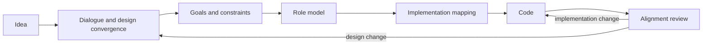

# CoIntent

**Turn ideas into living role models, and keep implementation aligned with intent.**

CoIntent is a software design convergence and implementation alignment system for humans and agents. Through continuous dialogue, it progressively turns a fuzzy idea into a versioned graph of goals, responsibilities, and roles, then uses semantic mappings to detect drift between that model and the code that implements it.

> The repository now contains a working vertical MVP: a Contexture-powered MCP server, a versioned SQLite model store, a read-only incremental Git scanner, explicit read REST routes, and a synchronized Role Book / Role Topology web interface.

## Why CoIntent?

Agentic software development exposes two persistent alignment gaps:

1. **Idea to design:** a person can describe what they want, but that description is rarely precise enough to become a coherent software system without repeated clarification and decomposition.
2. **Implementation to understanding:** an agent can rapidly change a codebase, but a person needs a stable, high-level view of what the system does, who owns each responsibility, and whether the implementation still matches the agreed design.

Most architecture tools start from code and visualize files, classes, functions, or dependencies. CoIntent starts from intent. Code is mapped back to the design so that implementation changes can be interpreted at the level of goals, responsibilities, and role boundaries.

## Core loop



CoIntent treats dialogue as the mechanism through which the model evolves. Conversations are preserved as provenance, but the durable product of the dialogue is a structured, reviewable model.

## The Role Model

A **Role** is a logical unit of responsibility in a system. It is not necessarily a class, service, file, process, or AI agent. The implementation may use object-oriented, procedural, functional, workflow-based, or mixed techniques.

A role can describe:

- why it exists;
- which responsibilities it owns;
- which capabilities it provides;
- its inputs, outputs, rules, and constraints;
- its child roles and collaborators;
- the implementation artifacts that realize it;
- the conversations and decisions that explain its existence.

Role containment provides a navigable hierarchy. Collaboration, dependency, realization, and implementation links form a graph across that hierarchy.

## Two models, one alignment loop

CoIntent deliberately keeps two kinds of truth separate:

- **Intended model:** the normative, human-approved description of what the system should be.
- **Observed model:** the descriptive evidence extracted or inferred from what the implementation currently is.

Code analysis must not silently rewrite intent. Instead, CoIntent compares the two models and reports agreements, missing realizations, unexpected relationships, boundary changes, and uncertain mappings. A human or authorized agent can then update the design, update the implementation, or explicitly accept the difference.

## Agent-native by design

MCP is a required product interface, not an optional integration. CoIntent is built on [Contexture](https://github.com/CarterShi01/contexture-mcp), an MCP application framework that exposes a progressively disclosed graph of Roles, Skills, and Tools to agents while allowing the same application capabilities to back explicit REST routes for human interfaces.

A dedicated chat interface is not required: a person may work through their existing coding agent while CoIntent records relevant exchanges, proposes structured model changes, and renders the current system view. Contexture provides CoIntent's MCP and HTTP controller layer; CoIntent owns the design-convergence, model, mapping, and alignment domain services behind it.

Contexture's runtime `Role` is an agent capability and containment boundary. A CoIntent model `Role` is a domain record describing responsibility in the software being designed. They share responsibility-oriented thinking but must not be treated as the same entity.

The planned visual experience has two primary projections:

1. **Role Book** — a readable, structured description of goals, roles, responsibilities, contracts, decisions, and open questions.
2. **System Graph** — an interactive topology of role hierarchy, collaboration, dependencies, and implementation mappings.

Version history and design diffs make every accepted change traceable to its rationale and source evidence.

## Conceptual foundations

CoIntent builds on established software engineering ideas rather than introducing a new decomposition theory:

- **Goal-oriented requirements engineering and KAOS** for refining stakeholder goals and assigning responsibility.
- **OOram role modeling** for describing systems as collaborating roles.
- **Responsibility-Driven Design** for reasoning about roles, responsibilities, and collaborators.
- **IDEF0-style functional contracts** for inputs, outputs, controls, and mechanisms.
- **Software Reflexion Models** for comparing a high-level intended model with an observed implementation model.

CoIntent's focus is to connect these ideas in an agent-native, versioned, continuously reviewable workflow.

## What CoIntent is not

CoIntent is not intended to be:

- a file-, class-, or function-level code graph as its primary model;
- an enforcement of object-oriented implementation;
- an autonomous idea generator or a replacement for human product decisions;
- a code generator with diagrams attached;
- a system where inferred code structure automatically becomes design truth.

## MVP quick start

Prerequisites: Git, Python 3.11+, [uv](https://docs.astral.sh/uv/), and Node.js 24+.

```bash
uv sync --extra dev
npm --prefix web install

# Build the first intended model and observed snapshot from a local repository.
uv run cointent scan /path/to/idea-factory \
  --project-id idea-factory \
  --name "Idea Factory" \
  --seed-idea-factory

# Terminal 1: Contexture MCP + read-only REST API
uv run cointent serve

# Terminal 2: Role Book + Role Topology
npm --prefix web run dev
```

Open `http://127.0.0.1:5175`. The HTTP service listens on `127.0.0.1:8811`. For a local stdio agent connection, run `uv run cointent mcp`.

The scanner reads tracked Git files and metadata; it does not modify the target repository. Re-running the scan stores a content-addressed snapshot, compares it with the previous snapshot, and creates review findings only for changed evidence that touches a mapped role or crosses mapped role boundaries. Add `--include-untracked` only when uncommitted, untracked files are intentionally part of the evidence.

## Agent interface

MCP is the only model-mutation interface. Its capability graph exposes three workflow Skills and their typed Tools:

- `converge-design` preserves relevant human wording, inspects the accepted model, and stages a semantic proposal;
- `map-implementation` interprets repository facts as many-to-many evidence without copying the file tree into the Role Model;
- `review-implementation-change` classifies a detected delta before resolving it or proposing a design evolution.

Accepted intent and observed code are stored separately. A proposal names the exact model version it was based on; acceptance creates a new immutable version, and stale proposals cannot silently overwrite newer intent.

## Verification

```bash
uv run --extra dev pytest
npm --prefix web run build
```

## Documentation

The conceptual method and product boundaries are in [docs/design.md](docs/design.md). The implemented architecture, data lifecycle, interfaces, experiment result, and deployment procedure are in [docs/mvp.md](docs/mvp.md).

## Framework dependency

The project metadata pins Contexture `0.14.0` to the exact latest upstream commit available when this MVP was completed. This temporary Git pin provides reproducible builds until a corresponding stable Contexture release is published.

## Project status

CoIntent is at **MVP 0.1**. It proves the full storage and interaction skeleton with Idea Factory as a read-only experiment. Semantic role inference is deliberately human/agent-reviewed; the deterministic scanner produces implementation facts, not design truth.

Contributions, critiques, and relevant prior art are welcome.
