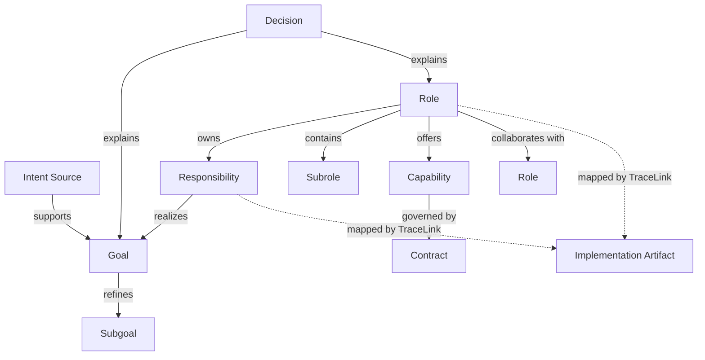
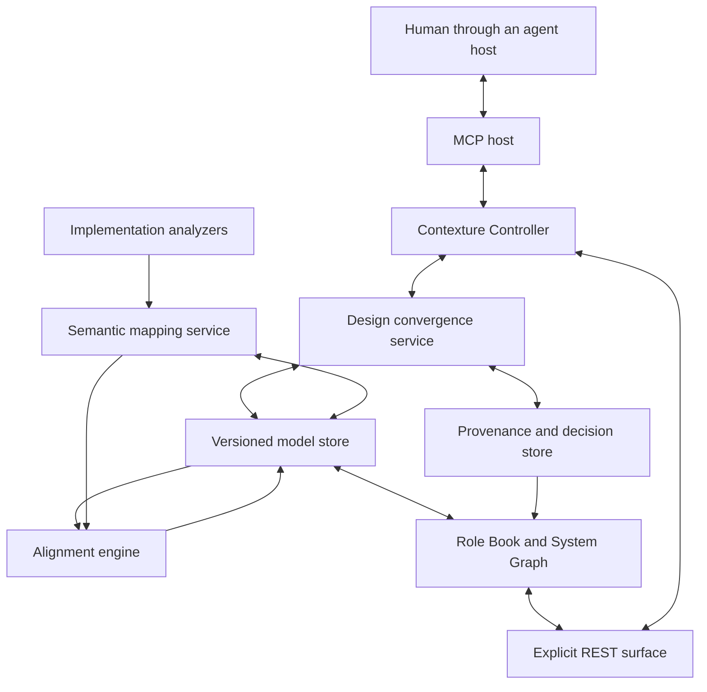

# CoIntent Design Proposal

**Status:** Initial design baseline

**Version:** 0.1

**Last updated:** 2026-09-08

## 1. Definition

CoIntent is a software design convergence and implementation alignment system for humans and agents. Through continuous dialogue, it progressively turns a fuzzy idea into a versioned graph of goals, responsibilities, and roles, then uses semantic mappings to detect drift between that model and the code that implements it.

The system addresses two related problems:

1. How can a human idea be progressively clarified until it is structured enough to guide implementation?
2. How can an implementation produced or changed by agents remain understandable and aligned with that agreed design?

CoIntent connects these problems through one persistent model. The model begins as an expression of intent, develops into a responsibility-oriented system design, and later becomes the semantic reference against which implementation changes are reviewed.

## 2. Scope and boundaries

### 2.1 In scope

- Dialogue-assisted refinement from an idea to goals, constraints, responsibilities, and roles.
- Hierarchical role decomposition and graph-based role collaboration.
- Human review and versioning of model changes.
- Traceability from model elements to source conversations and design decisions.
- Many-to-many mappings between logical roles and implementation artifacts.
- Semantic review of code changes against intended responsibilities and boundaries.
- Human-readable and machine-readable projections of the same canonical model.
- Agent-native access through MCP, implemented with the Contexture framework.

### 2.2 Out of scope

- Generating or evaluating startup ideas as a primary capability.
- Requiring the implementation to use object-oriented programming.
- Replacing detailed source-code navigation, dependency analysis, or IDE tooling.
- Treating files, functions, or classes as the primary conceptual model.
- Automatically accepting inferred implementation structure as intended design.
- Fully autonomous design decisions without an explicit review policy.

## 3. Design principles

### 3.1 Intent comes before structure

The primary model starts from why the system should exist and what outcomes it must produce. Existing code structure is evidence about implementation, not the source of design authority.

### 3.2 Roles represent responsibility, not code shape

A Role is a logical owner of responsibilities. It may map to one artifact, many artifacts, or no artifact yet. A class, module, service, person, external system, deterministic program, or reasoning agent may realize a role, but none of those implementation choices defines the role itself.

### 3.3 Design convergence is conversational

An initial idea is normally incomplete. CoIntent should help the human and agent expose ambiguity, assumptions, conflicts, missing constraints, and alternative decompositions. The model changes through proposed and reviewed patches rather than untracked document rewriting.

### 3.4 The hierarchy and the graph are complementary

Goal refinement and role containment provide tree-shaped navigation. Collaboration, dependency, data flow, and realization are graph relationships. CoIntent should not force all relationships into a single tree.

### 3.5 Intended and observed reality remain separate

The intended model describes what the system should be. The observed model describes what can be evidenced from the current implementation. Alignment is the explicit comparison between them.

### 3.6 Every important claim should be explainable

Goals, role boundaries, responsibilities, mappings, and accepted exceptions should link to evidence such as a conversation segment, a decision, a test, a code location, or a human confirmation.

### 3.7 Uncertainty is modeled, not hidden

Agent-inferred goals and mappings carry confidence, origin, and review status. CoIntent should distinguish facts, assumptions, proposals, decisions, and unresolved questions.

### 3.8 Agent and human surfaces share one application boundary

Agent operations and human-facing views must act on the same domain services and concurrency rules. MCP is the required agent protocol. Explicit HTTP routes may serve the web interface, but they must not create a second model mutation path with different semantics.

## 4. Conceptual foundations

CoIntent combines established concepts at different stages of the lifecycle. No single historical method covers the complete loop.

### 4.1 Goal-oriented requirements engineering and KAOS

Goal-oriented requirements engineering treats stakeholder goals as the starting point for requirements elicitation and analysis. KAOS provides concepts for goal refinement, alternatives, constraints, obstacles, operationalization, and responsibility assignment to agents.

CoIntent adopts the following ideas:

- refine high-level intent into progressively more precise goals;
- preserve alternatives and conflicts instead of prematurely flattening them;
- stop decomposing when a goal can be assigned, verified, or operationalized;
- connect goals to the roles responsible for achieving them.

Reference: [Goal-Driven Requirements Engineering: the KAOS Approach](https://webperso.info.ucl.ac.be/~avl/gore.php)

### 4.2 OOram role modeling

OOram models a system as collaborating roles. A role describes a position in a collaboration rather than requiring a one-to-one correspondence with a class or object.

CoIntent adopts the Role Model as its central system abstraction:

- roles exist through their purpose, responsibilities, and collaborations;
- role models can be composed into larger models;
- a logical role remains independent of the implementation paradigm;
- the same implementation element may participate in multiple roles.

Reference: [Working with Objects: The OOram Software Engineering Method](https://www.manning.com/books/working-with-objects)

### 4.3 Responsibility-Driven Design

Responsibility-Driven Design begins with roles, responsibilities, and collaborators, delaying low-level implementation decisions.

CoIntent uses it as a quality framework for role boundaries:

- responsibilities should be cohesive;
- collaborators should be explicit;
- information and behavior should be assigned deliberately;
- overloaded, fragmented, or circular responsibility should be challenged during design convergence.

Reference: [Responsibility-Driven Design](https://www.wirfs-brock.com/Design.html)

### 4.4 IDEF0-style functional contracts

IDEF0 describes functions using inputs, outputs, controls, and mechanisms, with support for hierarchical decomposition.

CoIntent does not adopt IDEF0 as its primary model, because a function does not express responsibility ownership or collaboration. Its concepts are useful for defining a role's operational contracts:

- inputs consumed;
- outputs produced;
- controls and invariants that constrain behavior;
- mechanisms or realizers that perform the work.

Reference: [NIST Integration Definition for Function Modeling (IDEF0)](https://nvlpubs.nist.gov/nistpubs/Legacy/FIPS/fipspub183.pdf)

### 4.5 Software Reflexion Models

Software Reflexion Models compare a developer-defined high-level model with an observed source model through an explicit mapping between them.

CoIntent extends this pattern from structural architecture toward semantic responsibility alignment:

- the intended Role Model is the high-level model;
- extracted implementation evidence forms the observed model;
- trace links map implementation artifacts to goals, responsibilities, and roles;
- comparison reports convergence, absence, divergence, boundary changes, and uncertainty.

Reference: [Software Reflexion Models: Bridging the Gap Between Source and High-Level Models](https://www.cs.ubc.ca/~murphy/papers/rm/fse95.html)

## 5. Core model

### 5.1 Primary concepts

| Concept | Meaning |
| --- | --- |
| `IntentSource` | Original evidence: a human-agent exchange, imported requirement, note, or decision record. |
| `Goal` | A desired outcome or condition, including constraints and acceptance criteria. |
| `Role` | A logical unit that owns a coherent set of responsibilities. |
| `Responsibility` | An obligation held by a role in service of one or more goals. |
| `Capability` | An externally meaningful ability offered by a role. |
| `Contract` | Inputs, outputs, preconditions, postconditions, controls, and invariants. |
| `Scenario` | A behavior path involving one or more collaborating roles. |
| `Collaboration` | A typed relationship through which roles coordinate or depend on each other. |
| `ImplementationArtifact` | A repository, service, module, package, directory, file, symbol, endpoint, schema, job, configuration, or test. |
| `TraceLink` | A typed, evidenced mapping between model elements or between design and implementation. |
| `Decision` | An accepted or rejected design choice with rationale and evidence. |
| `AlignmentFinding` | A detected agreement, gap, divergence, boundary change, or uncertainty. |
| `ModelVersion` | An immutable accepted state plus provenance and a structured diff from its parent. |

### 5.2 Core relationships



The diagram is a simplified projection. The canonical model should support typed edges, stable identifiers, provenance, lifecycle state, and extension fields.

### 5.3 Role definition

A Role should be understandable without opening the code. A complete role may contain:

```yaml
role:
  id: role.order_fulfillment
  name: Order Fulfillment
  purpose: Ensure an accepted order reaches a terminal fulfillment outcome.
  responsibilities:
    - Validate that an order can enter fulfillment.
    - Coordinate inventory, payment, and delivery collaborators.
    - Expose the current fulfillment outcome.
  capabilities:
    - Start fulfillment
    - Query fulfillment status
  inputs:
    - Accepted order
  outputs:
    - Fulfillment outcome
  constraints:
    - An order must not be dispatched before payment authorization.
  collaborators:
    - role.inventory
    - role.payment
    - role.delivery
  subroles: []
```

This is illustrative syntax, not a committed serialization format.

### 5.4 Role quality heuristics

During design convergence, CoIntent should be able to raise questions such as:

- Does the role have a clear purpose?
- Are its responsibilities cohesive?
- Is a responsibility owned by no role or by several conflicting roles?
- Does the role expose a capability without accepting responsibility for its outcome?
- Is the role merely named after an implementation artifact?
- Is the role too broad to explain or too small to remain stable?
- Are collaborators and boundary-crossing data explicit?
- Can the role be changed internally without changing its public contract?
- Is the role decomposition driven by intent or accidentally copied from the current folder structure?

These are design review signals, not universal pass/fail rules.

## 6. Design convergence workflow

### 6.1 Stage A: capture the idea

The user begins with a statement of intent. CoIntent records it as source evidence without treating the first phrasing as a complete specification.

Expected outputs:

- initial intent statement;
- known stakeholders and boundaries;
- explicit unknowns;
- first model version or draft branch.

### 6.2 Stage B: clarify goals and constraints

The agent asks targeted questions and may challenge ambiguity, hidden assumptions, inconsistent terminology, unbounded scope, or conflicting quality goals.

Each exchange can produce one or more structured proposals:

- add, refine, merge, or remove a goal;
- add an assumption, constraint, acceptance criterion, or open question;
- record an alternative or conflict;
- introduce a term into the project vocabulary.

### 6.3 Stage C: assign responsibility and form roles

Goals are connected to responsibilities, and responsibilities are grouped into roles. The agent may propose role boundaries, but those boundaries remain reviewable design decisions.

The process continues until the model is sufficiently precise to answer:

- Which role owns each required outcome?
- What does each role promise to other roles?
- Which collaborations cross a boundary?
- What remains unresolved?
- What would count as successful implementation?

### 6.4 Stage D: establish a design baseline

A human or policy-authorized agent accepts a model version as the current intended design. Acceptance creates an immutable version with:

- parent version;
- structured model diff;
- actor and timestamp;
- rationale;
- supporting intent sources and decisions;
- unresolved questions and accepted risks.

### 6.5 Stage E: map implementation

As implementation begins or an existing codebase is imported, agents create TraceLinks between model elements and implementation artifacts.

Mappings may be:

- manually declared;
- proposed by an agent;
- inferred from code and configuration;
- confirmed by tests or runtime evidence;
- rejected or superseded.

Every inferred mapping should expose confidence, origin, and review status.

### 6.6 Stage F: review implementation change

For a code change, CoIntent should:

1. identify changed artifacts;
2. resolve directly and transitively affected TraceLinks;
3. summarize the semantic behavior change;
4. compare it with owned responsibilities and contracts;
5. classify potential alignment findings;
6. propose a design patch, implementation correction, accepted exception, or no model change;
7. preserve the review outcome as evidence.

The design is not automatically rewritten from the code. A code change may reveal a legitimate design evolution, an implementation bug, an intentional exception, or an uncertain mapping.

## 7. Intended and observed models

### 7.1 Intended model

The intended model is normative and versioned. It contains human-approved goals, roles, responsibilities, contracts, and decisions.

### 7.2 Observed model

The observed model is derived from evidence such as:

- repository structure and manifests;
- imports and dependency relationships;
- API routes and client calls;
- schemas and data access;
- tests and runtime traces;
- agent interpretation of behavior;
- explicit implementation annotations.

It may be incomplete or uncertain. It should never be presented as equivalent to intent.

### 7.3 Alignment findings

An alignment review may classify a relationship or responsibility as:

| Finding | Meaning |
| --- | --- |
| `Convergent` | Observed implementation evidence supports the intended model. |
| `Absent` | An intended responsibility or relationship has no sufficient implementation evidence. |
| `Divergent` | The implementation introduces behavior or coupling outside the intended model. |
| `BoundaryChange` | Responsibility appears to have moved, split, merged, or crossed a role boundary. |
| `Unmapped` | Design or implementation elements currently lack TraceLinks. |
| `Uncertain` | Available evidence is insufficient for a reliable conclusion. |
| `AcceptedException` | A reviewed difference is intentionally retained with rationale and scope. |

These findings are review inputs, not automatic verdicts.

## 8. Implementation mapping

### 8.1 Many-to-many semantics

Mapping must be many-to-many:

- one Role can be realized by several services, modules, files, functions, or configurations;
- one artifact can participate in several Roles;
- a cross-cutting responsibility may span multiple architectural units;
- a Role can exist before any implementation exists.

Forcing one Role to equal one class, folder, or service would make CoIntent unsuitable for procedural systems and would reproduce current code structure instead of modeling responsibility.

### 8.2 TraceLink properties

A TraceLink should eventually support:

- source and target stable identifiers;
- link type, such as `realizes`, `supports`, `verifies`, `stores`, or `invokes`;
- origin: manual, agent-inferred, static analysis, runtime, or import;
- confidence and review state;
- supporting evidence;
- valid model and implementation versions;
- optional ownership and expiry policy.

### 8.3 Mapping granularity

CoIntent should prefer the coarsest mapping that remains useful. Repository, service, module, package, endpoint, schema, job, and test mappings may be more stable than individual functions. Symbol-level links remain available when necessary but should not dominate the human-facing model.

## 9. Interaction and presentation

### 9.1 Agent-native interaction

CoIntent must be usable from existing coding-agent environments through MCP. A native chat panel is not required for the first product shape.

The agent interaction layer should support operations conceptually similar to:

- inspect the current model or a focused subgraph;
- retrieve the evidence and decisions behind a model element;
- ask for unresolved design questions;
- propose a structured model patch;
- review and accept or reject a proposal;
- bind implementation artifacts to model elements;
- review a code diff for semantic design impact;
- compare model versions;
- explain a Role or trace an implementation artifact back to intent.

The MCP surface is implemented with Contexture. The domain model should remain independent of a single agent host or vendor even though MCP and Contexture are required application-level dependencies.

### 9.2 Two primary visual projections

The web experience should prioritize two synchronized views:

1. **Role Book**
   - goals and constraints;
   - role descriptions and responsibilities;
   - contracts, scenarios, decisions, and open questions;
   - implementation evidence and alignment findings.

2. **System Graph**
   - role containment;
   - role collaboration and dependencies;
   - goal realization;
   - implementation mappings;
   - overlays for change impact and alignment findings.

Selecting an element in either view should focus the corresponding elements in the other. Version history may appear as a timeline, diff mode, or contextual panel rather than a permanent third workspace column.

### 9.3 Conversation provenance

Relevant human-agent exchanges must be retained so that a user can inspect original intent. They are evidence, not the primary user-facing architecture.

A model change should be able to reference exact source segments. Sensitive content, retention policy, redaction, and access control will require explicit design before production use.

## 10. Required framework: Contexture

CoIntent depends on [Contexture](https://github.com/CarterShi01/contexture-mcp) as its Controller layer. Contexture allows an application to declare a graph of runtime Roles, Skills, and Tools, compile that graph, and expose a small fixed MCP gateway with progressive disclosure. The same runtime can also back an explicit allowlist of REST routes for human-facing interfaces.

CoIntent uses Contexture for:

- MCP stdio and Streamable HTTP transport;
- progressive discovery of CoIntent capabilities without placing the complete tool catalog in agent context;
- typed Tool input validation and invocation;
- read-only versus mutating Tool classification;
- lifecycle and shared dependency channels;
- explicit REST exposure for the Role Book and System Graph application where appropriate.

Contexture does not provide CoIntent's business model, persistence, agent loop, semantic mapper, or alignment logic. Those remain CoIntent domain services invoked through Contexture Tools.

### 10.1 Two different meanings of Role

Both projects use the term `Role`, but at different architectural levels:

| Term | Layer | Meaning |
| --- | --- | --- |
| Contexture `Role` | Application controller | A responsibility and containment boundary in the capability graph exposed to an agent. |
| CoIntent model `Role` | Product domain | A versioned logical owner of responsibilities in the software system being designed or analyzed. |

A Contexture Role such as `design-convergence` may expose Skills and Tools that create or inspect many CoIntent model Roles. The framework object must never be used as the persistence representation of the modeled system.

### 10.2 Initial Contexture capability graph

The first implementation should validate a capability graph along these lines:

```text
cointent
├── design-convergence
│   ├── inspect-model
│   ├── list-open-questions
│   ├── propose-model-patch
│   └── review-model-patch
├── implementation-mapping
│   ├── inspect-artifact
│   ├── bind-artifact
│   └── explain-trace
├── alignment
│   ├── review-change
│   ├── inspect-finding
│   └── record-resolution
└── history
    ├── compare-versions
    └── explain-decision
```

Names and grouping remain provisional until the domain operations are tested. Mutating Tools must be explicit, while inspection and explanation Tools should remain read-only.

### 10.3 Version policy

At this baseline, the latest upstream Contexture source declares version `0.13.0` but has no corresponding stable tag or PyPI release. CoIntent therefore pins the exact upstream Git commit in `pyproject.toml` for reproducibility. Once Contexture publishes a stable `0.13.x` release, the dependency should move to a compatible release constraint and a lockfile should continue to capture the selected artifact.

## 11. Proposed logical architecture



This is a responsibility decomposition, not a deployment recommendation. Contexture is the shared controller boundary for agent and explicit web operations. Early implementations may combine several domain services in one process.

## 12. Canonical representation and projections

CoIntent needs a canonical intermediate representation with a versioned schema. The Role Book, system graph, agent context, exports, and diffs should be deterministic projections of that representation.

Desired properties include:

- stable IDs that survive renaming and reorganization;
- typed nodes and edges;
- explicit schema version;
- model-level validation;
- provenance on nodes, edges, and field changes;
- deterministic serialization and diffing;
- extension points without weakening core semantics;
- import and export without loss of accepted decisions.

The first implementation should evaluate JSON, YAML, and a small domain-specific language before committing to a primary authoring format. The canonical format does not need to be the format humans edit directly.

## 13. Versioning and concurrency

Agent and web interactions may edit the same model, so model mutation requires explicit concurrency control.

The initial semantics should resemble optimistic version control:

- every read returns a model version;
- every proposal names its base version;
- accepted patches create a new immutable version;
- stale patches are rebased or rejected with a semantic conflict report;
- concurrent changes to unrelated model regions may be merged;
- accepted model changes preserve actor, rationale, and evidence.

This avoids silent last-writer-wins behavior while allowing agents and humans to work through different interfaces.

## 14. Initial product phases

### Phase 0: model foundation

- Bootstrap the Python project on the pinned Contexture version.
- Declare and validate the first Contexture Role, Skill, and Tool graph.
- Define the minimum schema for Goal, Role, Responsibility, Collaboration, IntentSource, Decision, TraceLink, and ModelVersion.
- Implement validation and deterministic serialization.
- Produce readable Role Book and Mermaid-based graph projections.
- Support structured model diff and version history.

### Phase 1: conversational design convergence

- Expose model inspection and patch proposal through Contexture's MCP surface.
- Preserve source exchanges as provenance.
- Add unresolved-question and assumption workflows.
- Implement role-quality review heuristics.
- Establish human approval and baseline semantics.

### Phase 2: implementation mapping

- Import repository-level and module-level implementation artifacts.
- Allow manual and agent-proposed TraceLinks.
- Provide artifact-to-role and role-to-artifact navigation.
- Store confidence and evidence for inferred mappings.

### Phase 3: semantic alignment review

- Analyze code diffs in the context of existing TraceLinks.
- Detect potential responsibility and boundary changes.
- Generate reviewable AlignmentFindings.
- Propose design patches or implementation corrections without automatically applying either.

### Phase 4: workflow integration

- Add on-demand review for local coding agents.
- Add optional pull-request or CI checks.
- Support policy configuration for advisory versus required review.
- Add importers and exporters for established architecture and requirements formats where useful.

## 15. MVP acceptance criteria

The first useful CoIntent release should demonstrate one complete vertical loop:

1. A user gives an incomplete software idea through an external coding agent.
2. The agent reaches CoIntent through its Contexture-powered MCP server.
3. The agent uses CoIntent to ask focused questions and propose goals and roles.
4. The user accepts a versioned Role Model baseline.
5. The Role Book and System Graph render from the same canonical data.
6. An implementation artifact is mapped to at least one responsibility or role.
7. A code change triggers a semantic impact review.
8. CoIntent explains whether the change appears aligned, divergent, or uncertain and cites its evidence.
9. The resulting design or implementation decision is preserved in version history.

The MVP does not need full automatic code comprehension. Reliable review with explicit uncertainty and human-confirmed mappings is more important than broad but opaque inference.

## 16. Key design risks

### 16.1 Role models become renamed code diagrams

**Risk:** Agents infer roles directly from folders or classes.

**Mitigation:** Require purpose and owned responsibility; treat code as evidence and use many-to-many mappings.

### 16.2 The model becomes documentation that nobody maintains

**Risk:** The Role Model drifts after implementation begins.

**Mitigation:** Make change review available inside agent workflows and focus findings on affected model regions.

### 16.3 Conversation produces uncontrolled model churn

**Risk:** Every speculative statement changes the design.

**Mitigation:** Separate source evidence, proposals, and accepted versions. Only reviewed patches modify the intended baseline.

### 16.4 False confidence in semantic inference

**Risk:** An agent incorrectly claims that code realizes or violates a responsibility.

**Mitigation:** Preserve evidence, confidence, and uncertainty; require approval for consequential model changes.

### 16.5 Excessive modeling overhead

**Risk:** The model becomes more expensive than the software it explains.

**Mitigation:** Support progressive detail, focus on stable responsibility boundaries, and prefer the coarsest useful mapping.

### 16.6 A universal role abstraction becomes vague

**Risk:** Trying to represent every concern as a Role erases important distinctions.

**Mitigation:** Keep Goal, Role, Responsibility, Capability, Contract, Scenario, data object, and implementation artifact as distinct concepts while making Role the primary navigation center.

## 17. Open questions

The following decisions should be validated through prototypes:

- What is the smallest canonical schema that supports a meaningful end-to-end loop?
- Which model elements require first-class node types, and which can begin as attributes?
- How should conversational evidence be captured across different agent hosts?
- Which changes require explicit human approval?
- How should sensitive source conversations be redacted or retained?
- Which implementation artifact types produce stable and useful mappings?
- What semantic diff format is easiest for both humans and agents to review?
- How should model branches relate to Git branches and pull requests?
- When should alignment review be on demand, hook-driven, or enforced in CI?
- Which parts of the observed model should be deterministic analysis versus agent interpretation?

## 18. Product statement

CoIntent turns software intent into a living responsibility model and keeps that model aligned with implementation.

Its primary artifact is neither a chat transcript nor a code diagram. It is a versioned, explainable agreement between humans and agents about why the system exists, how responsibility is divided, and where that responsibility is realized.
